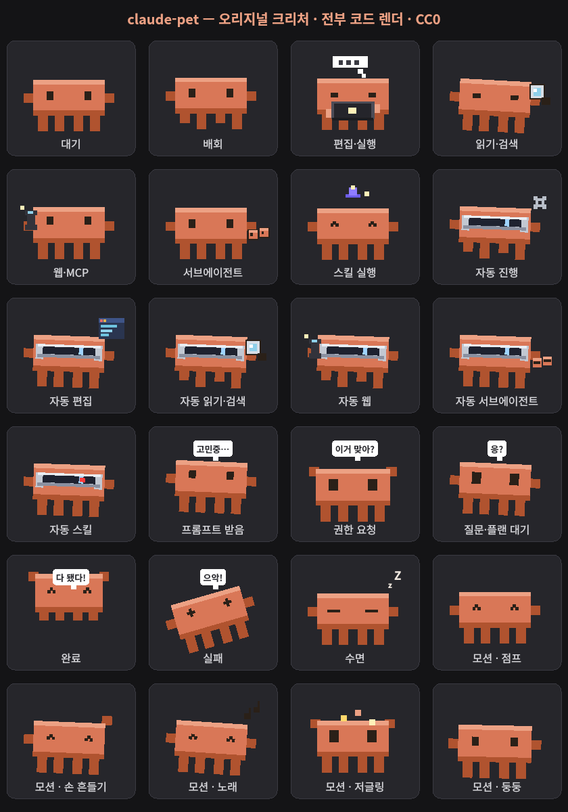

# claudlet 🐾

[English](README.md) | **한국어**

[](https://pypi.org/project/claudlet/)

**Claude Code**의 활동에 실시간으로 반응하는, 데스크톱 위에 사는 작은 픽셀 크리처예요.
Claude가 작업하면 타이핑하고, 입력이 필요하면 기다리고, 끝나면 신나하고, 코딩하는 동안
화면을 돌아다녀요. 클릭하면 터미널을 앞으로 가져와요.

아트는 전부 코드로 그려서(이미지 에셋 없음) 자체 완결적이고 오리지널이에요 (아트 CC0).

<p align="center">
  
</p>

## 실제 사용 모습

실제 데스크톱 화면 녹화 — 펫들이 터미널 타이틀바에 올라타고, 바탕화면을 돌아다니고,
작업 사이엔 잠들고(💤), 화면에 뭐가 떠 있든 그 위를 타고 다녀요.

<p align="center">
  
</p>

<p align="center">
  <br>
  <em>실제 데스크톱 캡처 — 화면에 뭐가 떠 있든 그 위를 돌아다녀요.</em>
</p>

### 에이전트 컴패니언

Claude가 **서브에이전트**를 띄우면, 하나당 모자 쓴 작은 도우미가 펫을 졸졸
따라다녀요 — 오리 행렬처럼 따라오고, 서브에이전트가 하는 작업을 따라 하고,
에이전트가 끝나면 "다 됐다!" 인사하고 떠나요.

<p align="center">
  <br>
  <em>실제 데스크톱 캡처 — 서브에이전트 2개, 세션 펫을 따라다니는 모자 쓴 컴패니언 2마리.</em>
</p>

<p align="center">
  
</p>

컴패니언마다 랜덤 모자를 써서 구분돼요:

<p align="center">
  
</p>

## 설치

[pipx](https://pipx.pypa.io)로 설치하고(격리 설치 — 의존성 자동 해결, macOS면
`pyobjc-framework-Quartz`까지, `claudlet*` 명령을 PATH에 올려줌), Claude Code에
연결:

```bash
pipx install claudlet
claudlet-install      # 훅 + /claudlet 스킬 등록 (idempotent)
```

버전 확인은 `claudlet-version` (설치본 vs 최신 릴리즈). **릴리즈** 최신으로는
`pipx upgrade claudlet && claudlet-install`, **master** 최신으로는
`pipx install --force "git+https://github.com/YeeDochi/Claudlet@develop" && claudlet-install`.
어느 쪽이든 끝나면 Claude Code 세션을 다시 시작해야(`claude --continue`) 새 훅+펫
코드가 로드돼요. 아니면 Claude Code 안에서 `/claudlet update`(릴리즈) /
`/claudlet update latest`(master) 하고 안내 따라가면 됩니다.

제거는 `claudlet-uninstall` (펫 종료 + 훅·스킬 해제; `--purge`면 설정도 삭제) 후
`pipx uninstall claudlet`.

<details><summary>pipx 없이 — 소스 한 줄 설치</summary>

`~/claudlet`로 클론(또는 업데이트)·의존성·훅+스킬 등록:
```bash
# Linux / macOS
curl -fsSL https://raw.githubusercontent.com/YeeDochi/Claudlet/master/install.py | python3 -
```
```powershell
# Windows (PowerShell)
irm https://raw.githubusercontent.com/YeeDochi/Claudlet/master/install.py | python -
```
</details>

이후 새 Claude Code 세션은 펫을 자동으로 띄워요. 이미 돌아가던 세션은 재시작해야 훅을
인식해요 — 아니면 `claudlet`로 지금 하나 띄워도 돼요.

**KDE Plasma**에서 가장 잘 동작해요. 창 위에 올라타기/타고 다니기는 **Windows**(Win32)와
**macOS**(실험적 — `pyobjc-framework-Quartz` 필요, 인스톨러가 자동 설치하고 창 좌표는
런타임에 자동 보정)에서도 되고, 그 외 환경에선 창 기능만 곱게 꺼지고 펫은 그냥 돌아다녀요.
→ **[플랫폼 지원](docs/platform.md)**

## 뭘 보여주나요

크리처의 포즈가 Claude가 지금 뭘 하는지를 따라가요 — 편집·읽기·MCP 호출·생각·
입력 대기·완료(위 시트 참고). **auto/bypass 모드**에선 VR 바이저를 끼고 순항하고, 작업 종류별로
변형이 있어요. 또 **창에 올라타고 함께 다녀요** — 상단을 걷거나 안에서 지내고, 올라탄 창이
가려지거나 최소화되면 같이 잘리거나 숨어요.

Claude가 **서브에이전트**를 돌리면 하나당 모자 쓴 **컴패니언**(최대 3마리)이 나타나 펫을
오리 행렬로 따라다니며 서브에이전트 활동을 반영하고, 끝나면 작은 축하와 함께 떠나요 — 에이전트
작업이 지금 돌고 있다는 걸 한눈에 보여줘요.

## 명령어

`pipx install claudlet` 하면 아래 명령들이 PATH에 깔려요:

| 명령어 | 하는 일 |
|---|---|
| `claudlet` | 펫 바로 실행 (standalone). |
| `claudlet-install` | Claude Code에 훅 + `/claudlet` 스킬 등록 — 설치 후 한 번 실행. |
| `claudlet-uninstall` | 펫 종료 + 훅·스킬 해제 + 정리 (`--purge`면 설정도 삭제). |
| `claudlet-config` | 사용자 설정 보기/생성/열기 (`--path`, `init`, `open`). |
| `claudlet-version` | 설치된 버전 vs PyPI 최신 릴리즈 표시. |
| `claudlet-attach` | 현재 Claude Code 세션에 펫 붙이기. |
| `claudlet-motion <이름>` | 실행 중인 펫에 모션 재생 (`jump`, `wave`, … ; `stop`, `list`). |
| `claudlet-install-hooks` | `claudlet-install`의 훅 부분만 (`--remove`로 취소). |
| `claudlet-macos-diag` | macOS 창 좌표 원본 출력 (perch 문제 진단). |
| `claudlet-hook` | 내부용 — Claude Code 훅이 호출, 직접 쓰는 게 아님. |

### `/claudlet` 스킬

`claudlet-install`이 `/claudlet` 스킬도 Claude Code에 링크해줘서, 프롬프트에서
바로 펫을 조종할 수 있어요:

- `/claudlet` — **이** 세션에 펫 붙이기 (세션 활동에 반응)
- `/claudlet standalone` — 세션에 안 붙은 장식용 펫
- `/claudlet <모션>` — `jump` · `wave` · `sing` · `juggle` · `float` · `celebrate` · `thinking` · `sleeping` · `error` · `attention` (그리고 `list`, `stop`)
- `/claudlet config` — 설정 보기, 또는 자연어로 요청("Bash 돌 때 점프하게")하면 Claude가 대신 편집
- `/claudlet update` — 최신 릴리즈로 업데이트 (`update latest`면 develop 최신); 버전 보여주고 단계 안내

## 문서

- **[사용법 & 인터랙션](docs/usage.ko.md)** — 드래그/던지기, 클릭-포커스, 트레이 메뉴, 모션, 자동시작, 제거
- **[설정](docs/configuration.ko.md)** — 어떤 활동에 어떤 애니를 보일지 재매핑 (`claudlet-config` 또는 `/claudlet config`로 위치 확인·점검)
- **[플랫폼 지원](docs/platform.ko.md)** — 지원 매트릭스 + 각 OS 테스트 방법

## 라이선스

코드: **MIT** ([LICENSE](LICENSE)). 크리처 아트: **CC0** ([NOTICE](NOTICE)).
