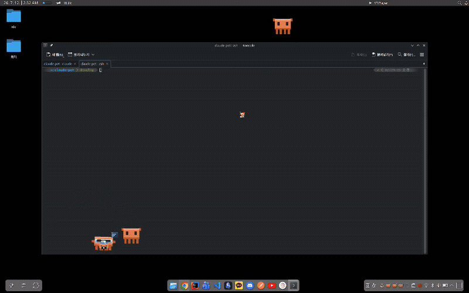

# claudlet 🐾

**English** | [한국어](README.ko.md)

[](https://pypi.org/project/claudlet/)

A tiny pixel creature that lives on your desktop and reacts to **Claude Code** in
real time — it types while Claude works, waits when Claude needs you, celebrates
when it's done, and roams around while you code. Click it to bring the terminal
back to the front.

Drawn entirely in code — no image assets — so it's self-contained and original
(CC0 artwork).


## See it in action

Real desktop capture. Pets perch on the terminal titlebar, roam the desktop, doze
off (💤) between tasks, and clamber over whatever else is on screen.


*Real desktop capture — they wander over whatever else is on your screen.*

### Agent companions

When Claude spawns **subagents**, a little hard-hatted sidekick trails your pet
for each one — a duckling chain that follows it around, mirrors what the
subagent is doing, and waves goodbye when its agent finishes.


*Real desktop capture — two subagents, two hatted companions trailing the session's pet.*


Each companion wears a random hat so you can tell them apart:


## Install

Install with [pipx](https://pipx.pypa.io) (an isolated app install — pulls the
deps, incl. `pyobjc-framework-Quartz` on macOS, and puts the `claudlet*`
commands on your PATH), then wire it into Claude Code:

```bash
pipx install claudlet
claudlet-install      # registers the hooks + /claudlet skill (idempotent)
```

Check your version with `claudlet-version` (installed vs latest release). Update
to the newest **release** with `pipx upgrade claudlet && claudlet-install`, or to
the tip of **develop** (edge) with `pipx install --force "git+https://github.com/YeeDochi/Claudlet@develop" && claudlet-install`.
Either way, restart your Claude Code session afterward (`claude --continue`) so the
new hooks + pet code load. Or just run `/claudlet update` (release) /
`/claudlet update latest` (master) from inside Claude Code and follow the prompts.

Remove it with `claudlet-uninstall` (stops pets, unregisters the hooks + skill;
add `--purge` to also delete your config), then `pipx uninstall claudlet`.

<details><summary>Without pipx — one-line source install</summary>

Clones (or updates) to `~/claudlet`, installs deps, registers hooks + skill:
```bash
# Linux / macOS
curl -fsSL https://raw.githubusercontent.com/YeeDochi/Claudlet/master/install.py | python3 -
```
```powershell
# Windows (PowerShell)
irm https://raw.githubusercontent.com/YeeDochi/Claudlet/master/install.py | python -
```
</details>

New Claude Code sessions then auto-spawn a pet. Restart any already-running session
to pick up the hooks — or launch one now with `claudlet`.

Best on **KDE Plasma**. Perching on and riding windows also works on **Windows**
(Win32) and **macOS** (experimental — needs `pyobjc-framework-Quartz`, which the
installer adds automatically; the pet self-calibrates window coordinates at
runtime). Elsewhere the window tricks switch off gracefully and the pet just
roams. See **[Platform support](docs/platform.md)**.

## What it shows

The creature's pose tracks what Claude is doing — editing, reading, calling MCP,
thinking, waiting on your input, celebrating (see the sheet above). In **auto /
bypass mode** it puts on a VR visor and cruises, with a per-tool variant for each
activity. It also **perches on and rides your windows** — walking along the top or
living inside — and clips/hides when the window it's on is covered or minimized.

When Claude runs **subagents**, a hatted **companion** appears for each one (up to
three) and trails the pet in a duckling chain, mirroring the subagent's activity
and leaving with a little celebration when it finishes — so you can see agent work
happening at a glance.

## Commands

`pipx install claudlet` puts these on your PATH:

| Command | What it does |
|---|---|
| `claudlet` | Launch a pet right now (standalone). |
| `claudlet-install` | Register the hooks + `/claudlet` skill in Claude Code — run once after installing. |
| `claudlet-uninstall` | Stop pets, unregister the hooks + skill, clean up (`--purge` also deletes your config). |
| `claudlet-config` | Show / scaffold / open the user config (`--path`, `init`, `open`). |
| `claudlet-version` | Show the installed version vs the latest PyPI release. |
| `claudlet-attach` | Attach a pet to the current Claude Code session. |
| `claudlet-motion <name>` | Play a motion on running pets (`jump`, `wave`, … ; `stop`, `list`). |
| `claudlet-install-hooks` | Just the hooks half of `claudlet-install` (`--remove` to undo). |
| `claudlet-macos-diag` | Print raw macOS window coordinates (perch troubleshooting). |
| `claudlet-hook` | Internal — invoked by Claude Code's hooks, not by you. |

### The `/claudlet` skill

`claudlet-install` also links a `/claudlet` skill into Claude Code, so you can
drive the pet straight from a prompt:

- `/claudlet` — attach a pet to **this** session (so it reacts to the session's activity)
- `/claudlet standalone` — an unattached, decorative pet
- `/claudlet <motion>` — `jump` · `wave` · `sing` · `juggle` · `float` · `celebrate` · `thinking` · `sleeping` · `error` · `attention` (plus `list`, `stop`)
- `/claudlet config` — show the config, or just ask in plain language ("jump when I run Bash") and Claude edits it for you
- `/claudlet update` — update to the latest release (`update latest` for the tip of develop); shows your version and walks you through it

## Docs

- **[Usage & interaction](docs/usage.md)** — drag & throw, click-to-focus, tray menu, motions, autostart, uninstall
- **[Configuration](docs/configuration.md)** — remap which animation shows for which Claude Code activity (run `claudlet-config` or `/claudlet config` to locate & inspect it)
- **[Platform support](docs/platform.md)** — support matrix + how to test on your OS

## License

Code: **MIT** (see [LICENSE](LICENSE)). Creature artwork: **CC0** (see [NOTICE](NOTICE)).
