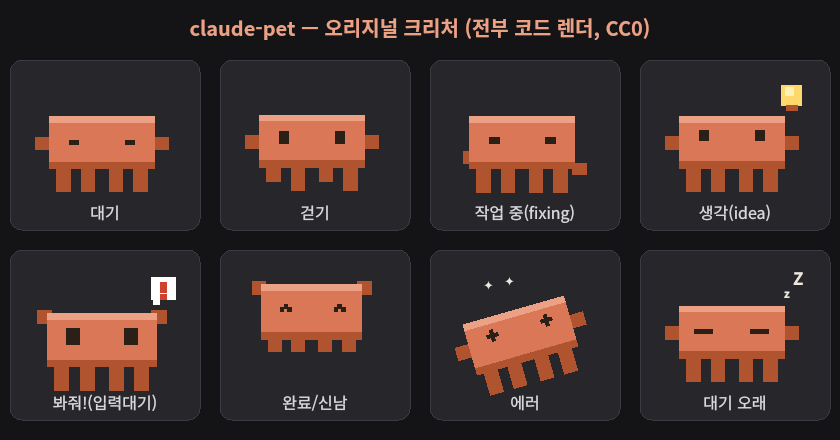

# claude-pet 🐾

A tiny pixel creature that lives on your desktop and reacts to **Claude Code** in
real time. It wanders around, and when Claude starts working it hops behind a
laptop and types; when Claude needs your input it jumps up and waves a `!` at
you. Click it to bring the Claude Code terminal back to the front.

Built for **KDE Plasma (Wayland)**. The creature is drawn entirely in code — no
image assets — so the whole thing is self-contained and original.



## States

| State | Looks like | Triggered by (hook) |
|-------|-----------|---------------------|
| idle / waiting | wandering, then dozes (`zZ`) | no active session |
| working | behind a laptop, hands typing, thinking `...` | `PreToolUse` / `PostToolUse` |
| thinking | 💡 lightbulb | `UserPromptSubmit` |
| **attention** | jumps up, arms raised, **`!` bubble** | `Notification` |
| celebrate | happy hop | `Stop` (then settles to waiting) |
| error | tips over, `X_X` | (reserved) |

## How it works

```
Claude Code ──hook──▶ claude-pet-hook ──unix socket──▶ pet (PyQt6 window)
```

- **`src/pet.py`** — the pet: a frameless, translucent, always-on-top window.
  It runs under XWayland (`QT_QPA_PLATFORM=xcb`) so it can roam freely, since
  native Wayland forbids a client from positioning its own window.
- **`src/creature.py`** — the creature renderer (pure `QPainter`, state-driven).
- **`bin/claude-pet-hook`** — forwards each Claude Code hook event to the pet
  over a unix socket (`$XDG_RUNTIME_DIR/claude-pet.sock`). Never blocks Claude.

## Requirements

- KDE Plasma on Wayland (XWayland available), `qdbus6` (for click-to-focus)
- `wmctrl` (optional) — hides the pet from the taskbar; falls back gracefully if absent
- Python 3 + PyQt6 — `pip install PyQt6`

## Install

```bash
git clone <this-repo> ~/claude-pet
pip install PyQt6
~/claude-pet/bin/claude-pet-install-hooks      # register hooks in ~/.claude/settings.json
~/claude-pet/bin/claude-pet                     # run it
```

Restart any running Claude Code session so it picks up the new hooks.

## `/claude-pet` skill (optional)

A Claude Code skill to launch a pet on demand from within a session. Enable it
by linking it into your skills dir:

```bash
mkdir -p ~/.claude/skills
ln -s ~/claude-pet/skills/claude-pet ~/.claude/skills/claude-pet
```

Then type `/claude-pet` (or "펫 띄워") in any session to launch one. This only
*launches* a pet; the per-session auto-launch still comes from the hooks above.

## Interaction

- **Drag** to pick it up and throw it — it falls with gravity and bounces.
- **Left-click** — bring the Claude Code terminal (Konsole) to the front.
- **Right-click** — menu: *come here* / *quiet (mute)* / *quit*.

## Autostart

Copy the desktop entry so it launches at login:

```bash
cp ~/claude-pet/packaging/claude-pet.desktop ~/.config/autostart/
```

Remove that file to disable.

## Custom art (bring your own)

The default creature is code-drawn. If you'd rather use your own animated
sprites, drop `<state>.gif` files in `assets/` — `assets/` is git-ignored so
your art never ends up in the repo. (GIF override rendering is a planned
feature; see the design doc.)

## Uninstall

```bash
~/claude-pet/bin/claude-pet-install-hooks --remove
rm ~/.config/autostart/claude-pet.desktop
rm -rf ~/claude-pet
```

## License

Code: MIT. Original artwork (the creature): CC0.
